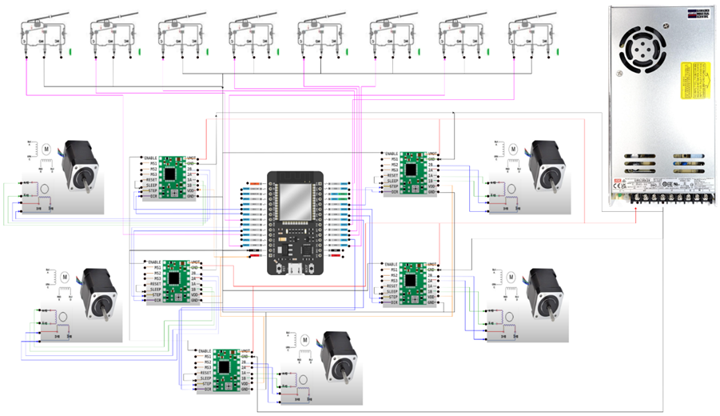

Bienvenue dans le repo du projet! 
   - Pour cloner le projet et travailler localement:
   
    1. copier l'URL du repo (via github)
    2. ouvrir un terminal ou command prompt
    3. naviguer jusqu'au folder ou vous voulez avoir les fichiers de code du 
       projet (dans le terminal, cd "le nom du folder" pour rentrer dedans)
    4. une fois dans le bon folder, utiliser la commande git clone avec l'URL
    5. ouvrir le folder dans vscode
    6. pour ajouter du code, modifier du code: 
       créer une nouvelle branche, une pull request, puis merge la pull request dans la branche principale

source: https://www.youtube.com/watch?v=eLmpKKaQL54&t=151s

Le github est maintenant connecté au jira!

   - Lorsqu'une branche est prête à être merged, il faut référencer le code de 
     l'issue jira pour que le merge soit reconnu par jira:
   
    1. trouver le key issue pour la tâche (issue) concernée (ex JRA-123)
    2. utiliser la clée dans le nom de la branche lors de la création
       (ex JRA-123-branchName)
    3. utiliser la clée au début du commit message au moment de commit les 
       changements dans la branche (ex JRA-123 résumé des changements)
    4. au moment de créer une pull request dans github, utiliser la clée dans
       le titre de la pull request

Tips and tricks pour la gestion de GitHub.
   - Quand 2 personnes travaillent sur le même fichier de code:

    1. chaque personne doit créer sa propre branche avant de commencer.
    2. ouvrir un terminal
    3. cd jusqu'à l'emplacement du folder de projetS4
    4. git branch (devrait montrer uniquement main)
       #si pas uniquement main: 
       #git checkout main
       #git branch -d Nom-de-la-branche-à-supprimer (répéter pour les branches qui ne sont pas main)
    5. git pull origin main
    6. ouvrir vscode
    7. créer une branche

   - La première personne qui termine peut faire comme d'habitude. Elle doit aussi avertir l'autre:
   
    1. dans vscode stage les changements (le symbole +)
    2. dans vscode écrire un commit message puis commit (la checkmark)
    3. dans vscode publier la branche (..., branch, publish branch)
    4. sur GitHub régler la pull request, merge la branche et supprimer la branche une fois que tout est fait
    5. ouvrir un terminal
    6. cd jusqu'au folder projetS4
    7. git checkout main
    8. git pull origin main
    9. git branch
       #si pas uniquement main: 
       #git checkout main
       #git branch -d Nom-de-la-branche-à-supprimer (répéter pour les branches qui ne sont pas main)

   - La deuxième personne qui finit doit suivre les étapes suivantes:

    1. ouvrir un terminal
    2. cd jusqu'au folder projetS4
    3. git status
       #si il y a des fichiers pas commit, il faut les commit
       #git add .
       #git commit -m 'ton commit message'
    4. git fetch origin
    5. git checkout main
    6. git pull origin main
    7. git checkout nom-de-la-branche-de-la-deuxième-personne
    8. git merge main
       #il se peut qu'il y aie des conflits, il faut les résoudre manuellement
       #un conflit apparait dans le code comme suit:
       #<<<<<<< HEAD
       #[Code de la branche principale]
       #=======
       #[Code de la branche de la deuxième personne]
       #>>>>>>> nom-de-la-branche-de-la-deuxième-personne
       #il faut choisir manuellement quoi conserver ou non dans le code des deux branches.
       #un fois que c'est fait, supprimer <<<<<<< HEAD, =======, >>>>>>> nom-de-la-branche-de-la-deuxième-personne
       #vérifier pour des erreures et que toutes les modifications sont la
    9. git add .
    10. git commit -m 'conflit résolu'
    11. git push origin nom-de-la-branche-de-la-deuxième-personne
    12. sur GitHub régler la pull request, merge la branche et supprimer la branche une fois que tout est fait
    13. Reload GitHub et vérifier que le fichier est à jour (les modifications sont la)

## Section du contrôle des moteur pas à pas : 

# Contrôleur Robotisé 5 Axes avec ESP32

Ce projet permet de contrôler un système robotisé 5 axes à l’aide d’un **ESP32**, 
en exécutant des instructions **G-code** reçues via une connexion série (par exemple depuis un Raspberry Pi). 
Il est idéal pour l’automatisation de tâches de type CNC pour la découpe de tissus.

---

# Objectifs

- Contrôler 5 moteurs pas à pas synchronisés (X, Y1, Y2, Z, ZRot)
- Exécuter dynamiquement des fichiers G-code
- Réaliser le homing de chaque axe, incluant la détection par cellule de charge pour le Z
- Communiquer avec un Raspberry Pi via port série
- Assurer la sécurité par arrêts d'urgence (limit switches)

---

# Matériel utilisé

| Composant                    | Quantité | Remarques                       |
|------------------------------|----------|---------------------------------|
| ESP32                        | 1        | Contrôleur principal            |
| Moteurs pas à pas NEMA 17    | 5        | Un pour chaque axe              |
| Drivers TMC2209 / A4988      | 5        | Avec contrôle STEP/DIR          |
| Fins de course               | 8        | X, Y (gauche/droite), Z, ZRot   |
| Cellule de charge            | 1        | Homing Z par détection de poids |
| Raspberry Pi                 | 1        | Pour l’envoi des G-code         |

---

# Fonctionnalités principales

**Interprétation du G-code** (`G00`, `G01`, `X`, `Y`, `Z`, `ZRot`)
**Homing automatique** complet (avec recul de sécurité et calibration)
**Interface série** pour chargement du G-code et commandes en direct
**Sécurité intégrée** via fins de course et état d’urgence
**Pause, redémarrage et suivi de progression** du G-code

---

# Commandes série disponibles

| Commande     | Description                                  |
|--------------|----------------------------------------------|
| `UPLOAD`     | Envoie d’un nouveau G-code (ligne par ligne) |
| `RUN_GCODE`  | Démarre l’exécution après homing             |
| `START`      | Lancement manuel sans homing                 |
| `PAUSE`      | Met le système en pause ou le relance        |
| `STOP`       | Arrête l’exécution en cours                  |
| `RESET`      | Réinitialise l’état d’urgence                |
| `HOME`       | Lance le homing complet                      |
| `STATUS`     | Affiche les états actuels et progression     |

---

# Structure du code

- `setup()` : Initialisation des moteurs, MultiStepper, entrées digitales
- `loop()` : Lecture série, exécution du G-code, gestion des états
- `moveXYZ()` : Mouvement coordonné sur les 5 axes
- `homeAxes()` : Homing complet avec détection de pression pour Z
- `processSerialCommand()` : Traitement des commandes envoyées par le Pi
- `executeGCodeCommand()` : Décodage et exécution d’une ligne G-code

## Installation et configuration (VS Code + PlatformIO)

Ce projet est conçu pour être utilisé avec **Visual Studio Code** et l’extension **PlatformIO**, idéale pour le développement sur microcontrôleurs comme l’ESP32.

---

# Installer les prérequis

- [✅] [Visual Studio Code](https://code.visualstudio.com/)
- [✅] [PlatformIO IDE](https://platformio.org/install/ide?install=vscode) (disponible via les extensions VS Code)

---

## Schéma électrique de la découpeuse de tissus :
